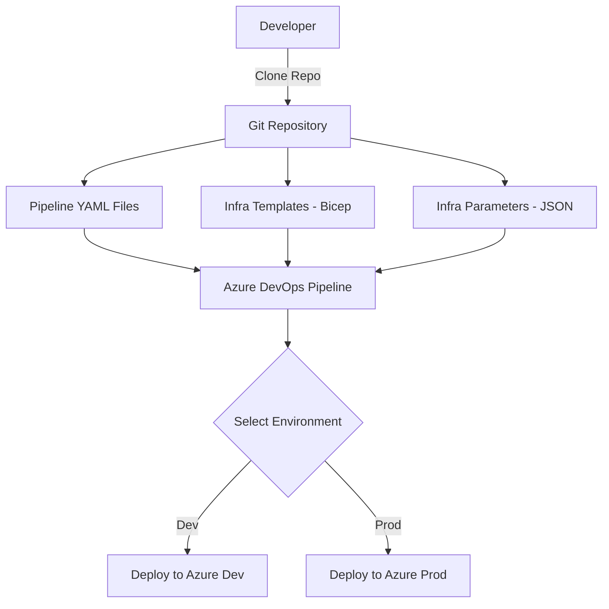

# Azure Infrastructure as Code (IaC) 

This repository provides the Infrastructure as Code (IaC) setup for deploying Azure resources using Bicep and Azure Pipelines. It is organized into templates, parameter files, and pipeline configurations for multiple environments (dev and prod).

## 📁 Project Structure 

```
AZURE-INFRA/
├── Infrastructure/
│   ├── Parameters/                     # Environment-specific parameter files
│   │   ├── infrastructure.dev.parameters.json
│   │   └── infrastructure.prod.parameters.json
│   ├── Templates/                      # Bicep templates for infrastructure components
│   │   ├── Compute.bicep
│   │   ├── Network.bicep
│   │   ├── Storage.bicep
│   │   └── infrastructure.bicep       # Main entry point for deployment
├── Pipelines/
│   ├── Variables/                      # Environment-specific and default pipeline variables
│   │   ├── azure.infrastructure.variables.default.yml
│   │   ├── azure.infrastructure.variables.dev.yml
│   │   └── azure.infrastructure.variables.prod.yml
│   ├── azure.infrastructure.dev.yml   # CI/CD pipeline for dev environment
│   ├── azure.infrastructure.prod.yml  # CI/CD pipeline for prod environment
│   └── azure.infrastructure.shared.yml# Shared pipeline configuration
├── .gitignore
├── LICENSE
└── README.md
```

## 📝 Azure Resource Naming Convention

This project follows a structured naming convention to ensure consistency, clarity, and compliance across all Azure resources.

### Naming Pattern
```
{resourceType}-{projectName}-{environment}-{region}-{instance}
```

### Naming Components

| Component | Description | Examples |
|-----------|-------------|----------|
| **resourceType** | Abbreviated resource type identifier | `rg`, `vm`, `st`, `vnet`, `nsg` |
| **projectName** | Project or application identifier (3-8 chars) | `myapp`, `webapp`, `api` |
| **environment** | Environment designation | `dev`, `stg`, `prod` |
| **region** | Azure region abbreviation | `eus`, `wus`, `neu`, `seu` |
| **instance** | Instance number or identifier (01-99) | `01`, `02`, `main` |

### Resource Type Abbreviations

| Azure Resource | Abbreviation | Example |
|----------------|--------------|---------|
| Resource Group | `rg` | `rg-myapp-dev-eus-01` |
| Virtual Machine | `vm` | `vm-myapp-prod-eus-01` |
| Storage Account | `st` | `stmyappprodeus01` |
| Virtual Network | `vnet` | `vnet-myapp-dev-eus-01` |
| Subnet | `snet` | `snet-myapp-dev-eus-web` |
| Network Security Group | `nsg` | `nsg-myapp-dev-eus-web` |
| Public IP | `pip` | `pip-myapp-prod-eus-01` |
| Load Balancer | `lb` | `lb-myapp-prod-eus-01` |
| Application Gateway | `agw` | `agw-myapp-prod-eus-01` |
| Key Vault | `kv` | `kv-myapp-prod-eus-01` |
| App Service Plan | `asp` | `asp-myapp-dev-eus-01` |
| App Service | `app` | `app-myapp-dev-eus-01` |
| Function App | `func` | `func-myapp-dev-eus-01` |
| SQL Server | `sql` | `sql-myapp-prod-eus-01` |
| SQL Database | `sqldb` | `sqldb-myapp-prod-eus-01` |
| Cosmos DB | `cosmos` | `cosmos-myapp-prod-eus-01` |
| Application Insights | `appi` | `appi-myapp-dev-eus-01` |
| Log Analytics Workspace | `law` | `law-myapp-prod-eus-01` |

### Region Abbreviations

| Azure Region | Abbreviation |
|--------------|--------------|
| East US | `eus` |
| East US 2 | `eus2` |
| West US | `wus` |
| West US 2 | `wus2` |
| Central US | `cus` |
| North Europe | `neu` |
| West Europe | `weu` |
| Southeast Asia | `sea` |
| East Asia | `ea` |
| UK South | `uks` |
| UK West | `ukw` |

### Special Considerations

**Storage Accounts**: Due to Azure's naming restrictions (lowercase, no hyphens, 3-24 characters), storage accounts follow a condensed format:
```
st{projectName}{environment}{region}{instance}
```
Example: `stmyappdeveus01`

**Key Vaults**: Must be globally unique and follow DNS naming rules:
```
kv-{projectName}-{environment}-{region}-{instance}
```
Example: `kv-myapp-prod-eus-01`

### Naming Examples

**Development Environment:**
```
rg-webapp-dev-eus-01           # Resource Group
vnet-webapp-dev-eus-01         # Virtual Network
snet-webapp-dev-eus-web        # Web Subnet
nsg-webapp-dev-eus-web         # Network Security Group
vm-webapp-dev-eus-01           # Virtual Machine
stwebappdeveus01               # Storage Account
kv-webapp-dev-eus-01           # Key Vault
```

**Production Environment:**
```
rg-webapp-prod-eus-01          # Resource Group
vnet-webapp-prod-eus-01        # Virtual Network
snet-webapp-prod-eus-web       # Web Subnet
snet-webapp-prod-eus-data      # Data Subnet
nsg-webapp-prod-eus-web        # Web NSG
nsg-webapp-prod-eus-data       # Data NSG
lb-webapp-prod-eus-01          # Load Balancer
vm-webapp-prod-eus-01          # VM Instance 1
vm-webapp-prod-eus-02          # VM Instance 2
stwebappprodeus01              # Storage Account
kv-webapp-prod-eus-01          # Key Vault
```

### Implementation in Bicep

The naming convention is implemented in Bicep templates using parameters and variables:

```bicep
@description('Project name used in resource naming')
param projectName string = 'myapp'

@description('Environment designation')
@allowed(['dev', 'stg', 'prod'])
param environment string

@description('Azure region abbreviation')
param regionAbbr string = 'eus'

// Variables for consistent naming
var resourceGroupName = 'rg-${projectName}-${environment}-${regionAbbr}-01'
var vnetName = 'vnet-${projectName}-${environment}-${regionAbbr}-01'
var storageAccountName = 'st${projectName}${environment}${regionAbbr}01'
```

## 🚀 Deployment Overview

This infrastructure project supports automated deployment to Azure using Azure DevOps pipelines.

## 🔧 Templates

The `Templates/` folder includes modular Bicep files:
- **Compute.bicep** – Resources like VMs, VMSS.
- **Network.bicep** – VNETs, Subnets, NSGs.
- **Storage.bicep** – Storage accounts, blobs, etc.
- **infrastructure.bicep** – Aggregates all modules for deployment.

## 📄 Parameters

Environment-specific parameters (dev and prod) are stored as JSON files in the `Parameters/` directory.

## 🧪 Pipelines

Each environment has a corresponding Azure Pipeline YAML file under the `Pipelines/` folder:
- `azure.infrastructure.dev.yml`
- `azure.infrastructure.prod.yml`
- Shared logic in `azure.infrastructure.shared.yml`

Environment-specific and default variables are in the `Variables/` subfolder.

## 🛠️ How to Use

### 1. Clone this repository

```bash
git clone <repo-url>
```

### 2. Configure Azure DevOps Pipelines

Link `azure.infrastructure.dev.yml` or `azure.infrastructure.prod.yml` to a pipeline in Azure DevOps.

### 3. Adjust Parameters

Modify the relevant JSON file in `Infrastructure/Parameters/` to customize deployment settings.

### 4. Run the Pipeline

Trigger the appropriate pipeline for deployment to the desired environment.

## 📊 Diagram


